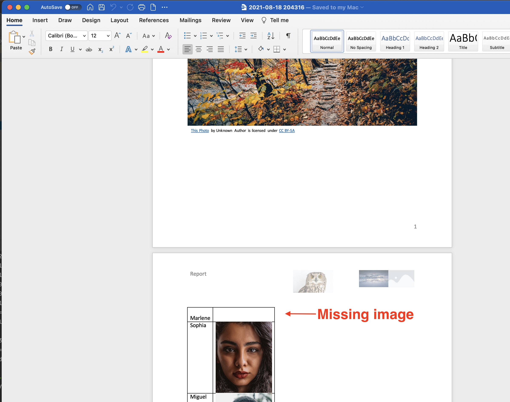
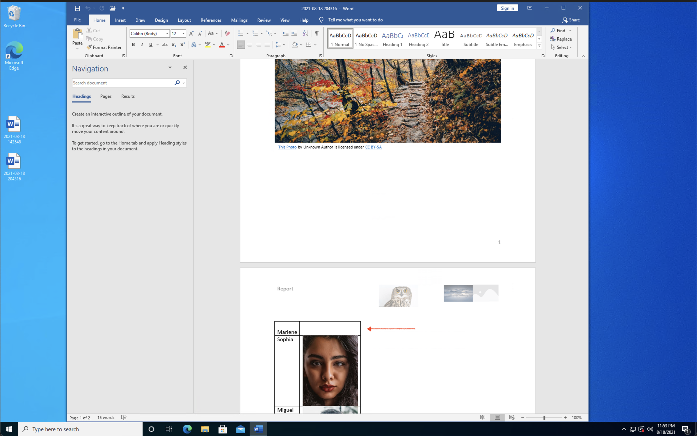
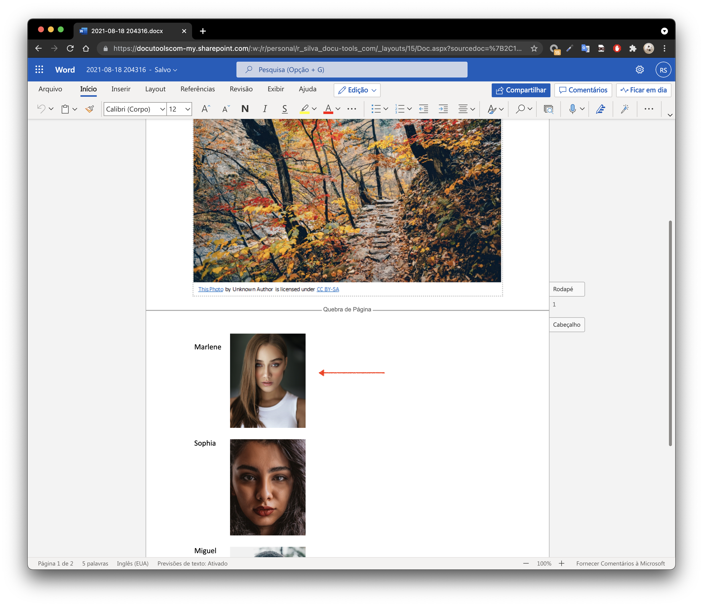

### About

This project demonstrates that on generate a DOCX from another DOCX with images. Neither all images added are shown  MS Word for Mac nor MS Word for Windows.
 
### Requirements

java-16

### How to reproduce

Running the existing test will create a docx in the user Desktop dir.

```bash
./gradlew test
```

Microsoft® Word for Mac - Version 16.52 (21080801)


Microsoft® Word for Windows 2019 MSO (16.0.14228.20216) 32-bit


Microsoft® Word for Web (16.0.14413.41001)
